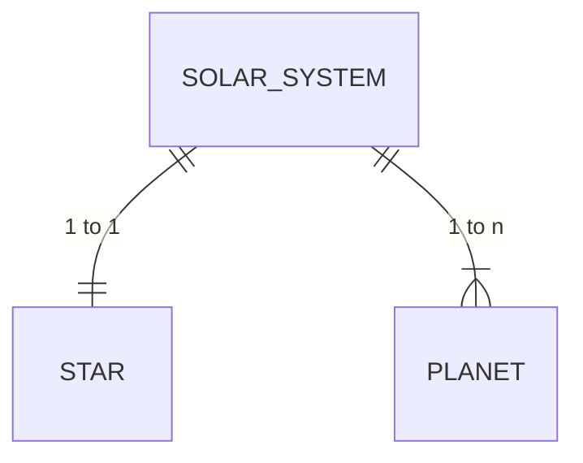

# GraphQL API

This is small graphQL API written in Ruby on Rails. The purpose of this was to dig into how GraphQL works, so it doesn't handle Authentication and Authorization. 

How to start:
  * run `rails db:migrate`
  * run `rails db:seed` to populate your db with data of our Solar System
  * run `rails s`
  * download [GraphiQL](https://github.com/graphql/graphiql) app - playground for GraphQL 
  * use `http://localhost:3000/graphql` endpoint

I've included example queries and mutations in specs. 

To Do:
- [ ] Add mutations for Stars and Planets
- [ ] Add Authentication & Authorization
